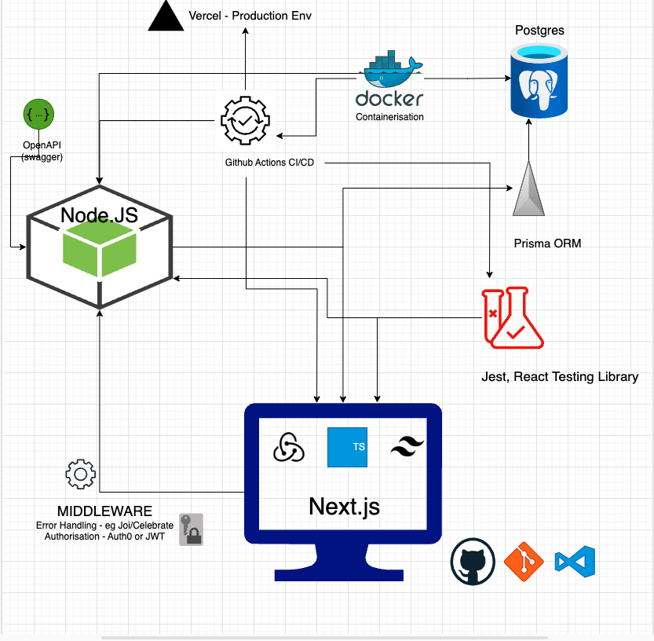

# My Project


## Overview

This app is still in development and subject to change. Still deciding if I'll host my backend on a seperate nodejs express app or just use next.js and as such will defer any decisions to use swagger at this stage. 

## Architect Diagram



## Prerequisites
- Code editor (VScode)
- Node
- Docker

## Getting Started

```docker compose up --build```
- If you don't have docker or don't wish to use it, you can ```npm install``` followed by ```npm run dev```

## Testing
```npm test``` (you may also notice a testing service in docker when you spin it up :) 

- TODO - though config has been setup with github actions and docker. 
